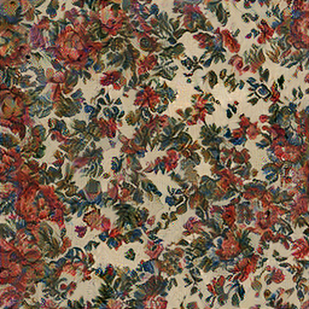

# Texture Synthesis in PyTorch

This is a PyTorch implementation of the *Texture Synthesis Using Convolutional Neural Networks* paper (https://arxiv.org/abs/1505.07376) by Gatys et al. (2015). The code is based on the original Caffe codebase by the authors of the paper (https://github.com/leongatys/DeepTextures).

## Example Inputs (*left*) and Outputs (*right*)

 

 

## How can I generate my own texture?

* **CPU Version:** Inside the project folder, run `conda env create -f environment_cpu.yml` to create a Conda environment with all the dependencies. It is recommended to run this command as administrator.
* **GPU Version:** Inside the project folder, run `conda env create -f environment_gpu.yml` to create a Conda environment with all the dependencies. It is recommended to run this command as administrator. Feel free to modify the `cudatoolkit` version in the `.yml` file, so that it corresponds to your CUDA version.
* Run `python synthesis.py` for a run with default arguments. This will generate a pebble texture similar to [this one](img/output_pebbles.png).
* Run `python synthesis.py -h` to see how you can choose your own input textures and tweak the optimizer settings.

## I'm getting a pickle-related error when running the code, what should I do?

The model is stored in this repository using [Git LFS](https://git-lfs.github.com/). It is therefore recommended to have Git LFS installed in order to fetch the model file. However, it is also possible to [download](models/VGG19_normalized_avg_pool_pytorch) it manually.

This also applies to the [file](data/reference_values.hdf5) containing reference values for unit testing.

## Can you explain more about the model? What are [`convert_model.py`](convert_model.py) and [`caffemodel2pytorch.py`](caffemodel2pytorch.py) for?

Gatys et. al use pretrained [VGG19](http://www.robots.ox.ac.uk/~vgg/research/very_deep/) with the following modifications:
* Fully connected (FC) layers are removed
* MaxPool layers are replaced by AvgPool
* Weights are scaled, so that the mean activation of each filter over images and positions is equal to 1.

Gatys et al. provide the model in Caffe format and [`convert_model.py`](convert_model.py) converts it to PyTorch via the following steps:
1.  Weigths are converted from `.caffemodel` to `.pt` using [`caffemodel2pytorch.py`](caffemodel2pytorch.py) which comes from [https://github.com/vadimkantorov/caffemodel2pytorch](https://github.com/vadimkantorov/caffemodel2pytorch).
2.  Pretrained `torchvision.models.vgg19` is loaded, FC layers are removed and MaxPool replaced by AvgPool
3. `.pt` weights are loaded into the PyTorch model.
4. The PyTorch model along with the weights is saved into a pickle using a custom function called [`VGG19_normalized_avg_pool_pytorch`](models/VGG19_normalized_avg_pool_pytorch).

Dependecies for these conversion scripts are not part of the Conda environment definition file because the converted PyTorch model can be used directly.

## How do you know that the reproduced results are correct?

A set of [unit tests](unit_test.py) is included in the repository. These tests compare values from the converted PyTorch model with those from the original code. Inputs and expected outputs for these tests are stored in a [separate file](data/reference_values.hdf5).

# Acknowledgements

The texture `img/pebbles.jpg` is from the original paper by Gatys et al. (https://arxiv.org/abs/1505.07376). `img/flowers.png` comes from Pixar 128 texture package (https://renderman.pixar.com/pixar-one-twenty-eight) where it is called `Woven_flower`.

The code is based on the original codebase by Gatys et al. (https://github.com/leongatys/DeepTextures), includes a Caffe to PyTorch converter by Vadim Kantorov (https://github.com/vadimkantorov/caffemodel2pytorch) and a model load/save functionality by Pauli Kemppinen.

# License

Just like the original codebase, this software can only be used for academic or non-commercial purposes.
